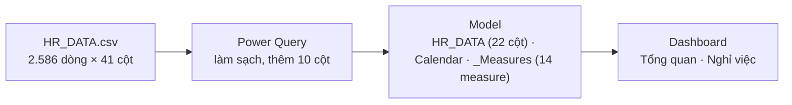
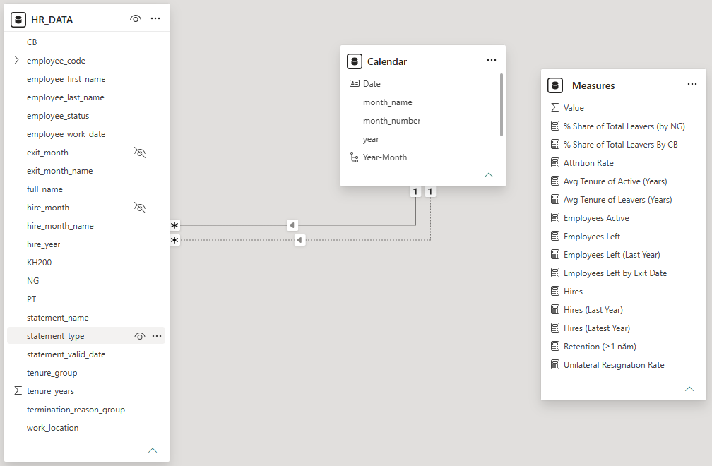
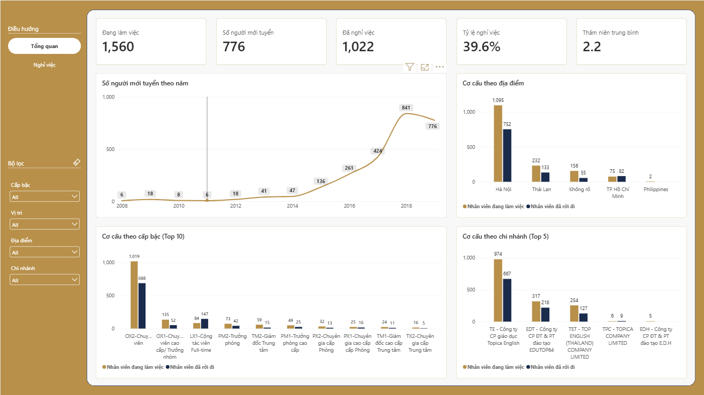
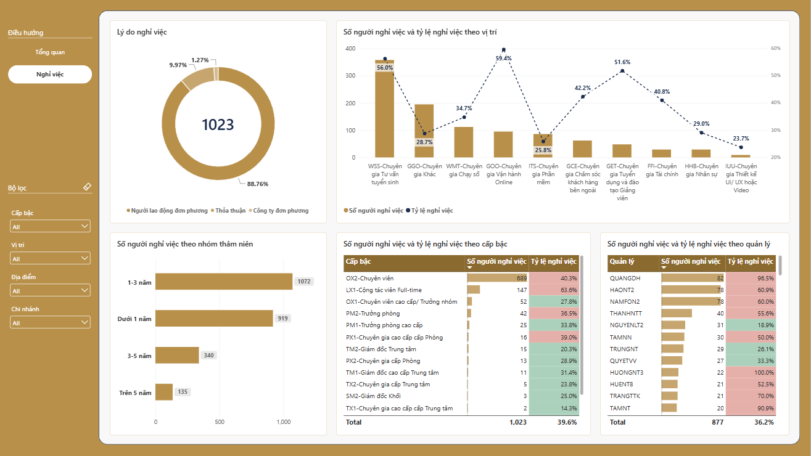

<div align="center">

# HR Contract & Workforce Analytics

### Phân tích biến động nhân sự và cơ cấu lực lượng lao động của Topica Edtech Group (2008-2019) từ 2.586 bản ghi hợp đồng nhân sự


</div>

---

## Mục lục

- [Project Overview](#project-overview)
- [Project Highlights](#project-highlights)
- [Repository Structure](#repository-structure)
- [Raw Data](#raw-data)
- [Data Pipeline](#data-pipeline)
- [Semantic Model](#semantic-model)
- [Dashboard](#dashboard)
- [Key Findings](#key-findings)
- [Tech Stack](#tech-stack)

## Project Overview

Dự án xuất phát từ 1 file CSV thô (`HR_DATA.csv`, 2.586 dòng × 41 cột) và file mô tả cột `Definition_Data.xlsx` (7 cột được định nghĩa). Dữ liệu được làm sạch trong Power Query, mô hình hóa trong Power BI và trình bày thành dashboard 2 trang. Mọi số liệu trong README được tính lại trực tiếp từ file CSV gốc, không lấy từ báo cáo có sẵn.

Dự án là bài tập portfolio tự định hướng, không có brief cố định từ bên giao. Các câu hỏi phân tích do người làm tự xác định. Phần kiểm tra chất lượng dữ liệu, phân tích cohort tuyển dụng và phân tích theo quản lý (`KH200`) là sáng kiến cá nhân, không nằm trong yêu cầu ban đầu.

**Các câu hỏi project trả lời:**
- Cơ cấu nhân sự hiện tại theo pháp nhân, cấp bậc, ngạch nghề và địa điểm ra sao? _(Ban lãnh đạo HR)_
- Tỷ lệ nghỉ việc là bao nhiêu, và trong đó bao nhiêu là tự ý nghỉ? _(Ban lãnh đạo HR)_
- Nghỉ việc tập trung ở nhóm nào (cấp bậc, ngạch nghề, địa điểm, quản lý phụ trách), và tỷ lệ nào đáng lo nhất? _(HRBP, quản lý tuyển dụng)_
- Công ty tuyển bao nhiêu người mỗi năm, và các đợt tuyển có liên quan đến biến cố tài chính nào không? _(Ban lãnh đạo, phòng tuyển dụng)_

**Nguồn dữ liệu:** file `HR_DATA.csv` được cung cấp trong khóa học Data Analyst. Nguồn gốc và người cung cấp dữ liệu không được ghi trong file. Dữ liệu bao phủ từ 2008 đến mốc cắt snapshot 2019-12-09, gồm 9 pháp nhân (cột `PT`). File gốc có họ tên và mã nhân viên. Dashboard không hiển thị họ tên nhân viên; trước khi công khai repo cần cân nhắc ẩn danh cột này.

## Project Highlights

| Area | What this project does |
|---|---|
| Làm sạch dữ liệu | Power Query giữ các cột có ý nghĩa, loại cột rỗng, cột hằng số, cột trùng lặp và mã nội bộ không có bảng tra cứu |
| Mô hình hóa | Bảng sự kiện `HR_DATA` nối với bảng ngày `Calendar` qua 2 quan hệ: ngày vào làm (active) và ngày nghỉ việc (inactive), dùng `USERELATIONSHIP` khi cần |
| Measure | 14 measure chia 5 folder, gồm so sánh cùng kỳ năm trước, tỷ trọng theo nhóm và tỷ lệ nghỉ việc trong từng nhóm |
| Kiểm tra chất lượng dữ liệu | Phát hiện 116 dòng có ngày vào làm sau ngày nghỉ việc và 4 dòng thiếu ngày vào làm; xử lý minh bạch thay vì ước lượng ngầm |
| Xác minh số liệu | Đối chiếu từng con số trên dashboard với tính toán độc lập bằng Python từ file CSV gốc |
| Dashboard | 2 trang: Tổng quan (cơ cấu và xu hướng tuyển dụng) và Nghỉ việc (phân tích theo cấp bậc, ngạch nghề, quản lý) |

## Repository Structure

```
HR Contract & Workforce Analytics/
├── HR_DATA.csv                  # Dữ liệu gốc, có sẵn từ đầu
├── Definition_Data.xlsx         # Mô tả 7 cột, có sẵn từ đầu
├── HR analytical report.docx    # Báo cáo tham khảo, không dùng làm nguồn số liệu, có sẵn từ đầu
├── Images/                      # Ảnh chụp 2 trang dashboard, xây trong quá trình làm
├── PowerBI/                     # Dự án Power BI (PBIP), xây trong quá trình làm
│   ├── HR Contract & Workforce Analytics.pbip
│   ├── HR Contract & Workforce Analytics.Report/
│   └── HR Contract & Workforce Analytics.SemanticModel/
├── topica-theme.json            # Theme màu và font, xây trong quá trình làm
├── README.md                    # Tài liệu này, xây trong quá trình làm
└── .gitignore                   # Loại trừ file tạm .pbi/ của Power BI, xây trong quá trình làm
```

## Raw Data

Nguồn: file `HR_DATA.csv` từ khóa học. Repo đã đưa lên GitHub. `.gitignore` hiện chỉ loại trừ 2 file tạm `.pbi/` của Power BI.

| File | Số dòng |
|---|---|
| `HR_DATA.csv` | 2.586 dòng, 41 cột |
| `Definition_Data.xlsx` | 7 định nghĩa cột |
| **Tổng** | **2.586 bản ghi nhân sự** |

Mỗi dòng là 1 nhân viên (`employee_code` không trùng). Mỗi nhân viên chỉ có **1 giao dịch gần nhất** (snapshot), không có toàn bộ lịch sử hợp đồng.

- `employee_code`: mã nhân viên, duy nhất cho mỗi dòng
- `employee_work_date`: ngày bắt đầu làm việc, dùng để đếm số người vào làm
- `statement_type`: loại giao dịch gần nhất (7 loại, ví dụ "Chấm dứt HĐLĐ", "Tuyển mới", "Đánh giá")
- `statement_name`: chi tiết giao dịch (21 loại). Hai ký tự đầu (GA, GB, GC) quyết định lý do nghỉ việc
- `statement_valid_date`: ngày có hiệu lực của giao dịch gần nhất, dùng làm ngày nghỉ việc với người đã nghỉ
- `PT`: pháp nhân (9 giá trị)
- `CB`: cấp bậc (22 giá trị)
- `NG`: ngạch nghề (11 giá trị)
- `work_location`: địa điểm làm việc (5 giá trị)
- `KH200`: mã người phụ trách, được dùng làm quản lý (xem Key Findings). 164 dòng để trống

**Xử lý dữ liệu chính trong `HR_DATA.csv`:**
- Đọc file với mã hóa UTF-8, ép kiểu ngày và số trong bước Changed column type.
- Loại các cột rỗng hoàn toàn, cột chỉ có 1 giá trị, cột trùng lặp (`created_at`, `modified_at`, `statement_created_date`, `statement_expired_date`) và mã nội bộ không có bảng tra cứu (`DV`, `SP`, `KH300`, `PB`).
- Tạo `employee_status`: "Left" nếu `statement_type` là "ZG - Chấm dứt HĐLĐ", còn lại là "Active".
- Tạo `termination_reason_group` từ 2 ký tự đầu của `statement_name`: GA thành "Người lao động đơn phương", GB thành "Công ty đơn phương", GC thành "Thỏa thuận", còn lại thành "Khác".
- Tạo `tenure_years` bằng số ngày từ `employee_work_date` đến mốc chia 365,25. Mốc là `statement_valid_date` với người đã nghỉ, và 2019-12-09 với người đang làm. Giá trị được để trống khi thiếu ngày vào làm hoặc khoảng ngày âm (120 dòng: 4 thiếu ngày, 116 mâu thuẫn ngày).
- Tạo `tenure_group` từ `tenure_years`: "Dưới 1 năm", "1-3 năm", "3-5 năm", "Trên 5 năm", "Không xác định".
- Tạo `hire_year`, `hire_month`, `exit_month`, `hire_month_name`, `exit_month_name` và `full_name`.
- Tạo bảng `Calendar` bằng `CALENDARAUTO()`, thêm `year`, `month_number`, `month_name` và hierarchy `Year-Month`.

## Data Pipeline



## Semantic Model



Mô hình gồm 3 bảng:

- `HR_DATA`: grain 1 nhân viên = 1 dòng (giao dịch gần nhất). Chứa trực tiếp cấp bậc, ngạch nghề, pháp nhân, địa điểm, lý do nghỉ việc. Không tách bảng dimension riêng vì dữ liệu phẳng, 1 dòng/nhân viên. Hai cột `hire_month` và `exit_month` được ẩn, chỉ dùng làm cột sắp xếp cho `hire_month_name` và `exit_month_name`.
- `Calendar`: grain 1 ngày, tạo bằng `CALENDARAUTO()`, đánh dấu Date Table. Quan hệ với `HR_DATA[employee_work_date]` (active) và `HR_DATA[statement_valid_date]` (inactive, chỉ dùng qua `USERELATIONSHIP`).
- `_Measures`: bảng rỗng dùng để chứa measure, không có quan hệ.

**14 measure, chia 5 folder:** Overview (5), Time (4), Termination (2), Turnover (2), Retention (1).

**Dashboard dùng trực tiếp 7 measure:** `Employees Active`, `Employees Left`, `Attrition Rate`, `Employees Left by Exit Date`, `Hires`, `Hires (Latest Year)`, `Avg Tenure of Active (Years)`.

**Các measure phức tạp nhất:**
- `Employees Left by Exit Date`: `CALCULATE` với `USERELATIONSHIP(Calendar[Date], HR_DATA[statement_valid_date])` để đếm người nghỉ theo ngày nghỉ, không theo ngày vào làm.
- `Hires (Latest Year)`: `CALCULATE` với `Calendar[year] = MAX(Calendar[year])` để ghim năm gần nhất, không phụ thuộc slicer.
- `Hires (Last Year)`: `DATEADD(Calendar[Date], -1, YEAR)` để so sánh cùng kỳ năm trước.
- `% Share of Total Leavers By CB`: `CALCULATE` với `ALL(HR_DATA[CB])` làm mẫu số. Chỉ đúng khi đặt trên trục `CB`, nên có bản riêng `(by NG)` cho ngạch nghề.
- `Retention (≥1 năm)`: tỷ lệ người trong nhóm tuyển cùng năm có `tenure_years` từ 1 trở lên.

## Dashboard

**1. Tổng quan**: 5 thẻ KPI (Đang làm việc, Đã nghỉ việc, Tỷ lệ nghỉ việc, Số người mới tuyển năm gần nhất, Thâm niên trung bình của người đang làm), biểu đồ đường "Số người mới tuyển theo năm" và 3 biểu đồ cơ cấu cột kép Đang làm vs Đã nghỉ theo địa điểm, cấp bậc (Top 10) và chi nhánh (Top 5). Có 4 slicer: cấp bậc, ngạch nghề, địa điểm, chi nhánh.



**2. Nghỉ việc**: biểu đồ tròn lý do nghỉ việc, biểu đồ cột kết hợp số người nghỉ và tỷ lệ nghỉ theo ngạch nghề, biểu đồ cột số người nghỉ theo nhóm thâm niên (không hiển thị nhóm "Không xác định"), bảng số người nghỉ và tỷ lệ theo cấp bậc, bảng số người nghỉ và tỷ lệ theo quản lý (đã loại dòng không có mã người phụ trách). Có 4 slicer: cấp bậc, ngạch nghề, địa điểm, chi nhánh.



Mở file bằng Power BI Desktop (bật PBIP trong File > Options > Preview features), chọn `PowerBI/HR Contract & Workforce Analytics.pbip`.

## Key Findings

> **Attrition Rate (tỷ lệ nghỉ việc)**: số người đã nghỉ việc chia cho tổng số nhân viên trong cùng phạm vi lọc. Khi không lọc, đây là tỷ lệ cộng dồn toàn bộ lịch sử, không phải tỷ lệ theo năm.
>
> **Tỷ lệ nghỉ việc trong nhóm**: cùng công thức, nhưng mẫu số là số người từng làm trong chính nhóm đó (cấp bậc, ngạch nghề, quản lý). Khác với **tỷ trọng** (% share): tỷ trọng lấy số người nghỉ của nhóm chia cho tổng số người nghỉ của công ty.
>
> **Retention (giữ chân ≥1 năm)**: tỷ lệ người trong cùng nhóm tuyển năm có thâm niên từ 1 năm trở lên.

**Số liệu quan sát được:**
- Tỷ lệ nghỉ việc toàn lịch sử là **39,6%** (1.023 trên 2.586).
- **88,8%** số người nghỉ việc là tự ý nghỉ (908 trên 1.023). Thỏa thuận chiếm **10,0%** (102) và công ty đơn phương chiếm **1,3%** (13).
- Cấp bậc Chuyên viên chiếm **67,4%** tổng số người nghỉ (689 trên 1.023), nhưng tỷ lệ nghỉ trong nhóm chỉ **40,3%**.
- Cộng tác viên Full-time có tỷ lệ nghỉ **63,6%** (147 trên 231), cao gần **1,6 lần** Chuyên viên.
- Ngạch Vận hành Online có tỷ lệ nghỉ **59,4%** (95 trên 160), cao nhất các ngạch. Ngạch Tư vấn tuyển sinh là **56,0%** (358 trên 639).
- TP. Hồ Chí Minh có tỷ lệ nghỉ **52,2%**, cao hơn Hà Nội (**40,7%**) dù quy mô nhỏ hơn.
- Quản lý `QUANGDH` có **96,5%** đội ngũ đã nghỉ (82 trên 85). Ngạch nghề chiếm phần lớn đội của người này có tỷ lệ nền chỉ **28,7%**, nên không thể giải thích bằng cơ cấu ngạch nghề.
- Có **6** quản lý có tỷ lệ nghỉ **100%**, với đội từ 5 đến 22 người.
- Quy mô đội không liên quan đến tỷ lệ nghỉ việc (hệ số tương quan **0,08**, với các quản lý có ít nhất 5 người).
- Tuyển dụng tăng từ **6** người (2008) lên đỉnh **841** (2018), rồi giảm còn **776** (2019). Tháng 1/2019 có **130** người vào làm, so với mức trung bình **70** người/tháng của năm 2018.
- Trong toàn bộ dữ liệu, **46** người vào làm chỉ trong ngày 04/01/2019.

**Lưu ý dữ liệu:**
- 98,9% ngày hiệu lực (`statement_valid_date`) dồn vào năm 2019 do cấu trúc snapshot. Vì vậy không dùng biến động nghỉ việc theo tháng để kết luận về mùa vụ.
- 116 người (11,3% nhóm đã nghỉ) có ngày vào làm sau ngày nghỉ việc, được xếp vào nhóm "Không xác định" thâm niên.
- Với cấu trúc 1 dòng/nhân viên, không dựng lại được headcount tại một thời điểm quá khứ, chỉ đếm được các sự kiện (vào làm, nghỉ việc) theo ngày.

**Đề xuất hành động:**
1. Rà soát các quản lý có tỷ lệ nghỉ gần toàn bộ đội: nhóm này cho thấy vấn đề nằm ở cấp quản lý, không phải do ngạch nghề vốn dễ nghỉ.
2. Ưu tiên giữ chân Cộng tác viên Full-time và ngạch Vận hành Online theo tỷ lệ thay vì số tuyệt đối, vì 2 nhóm này nhỏ nhưng tỷ lệ nghỉ cao nhất, nên dễ bị bỏ sót khi chỉ nhìn số lượng.
3. Chuẩn hóa việc ghi nhận người phụ trách (`KH200`) cho mọi nhân viên, vì phần lớn người nghỉ việc không có mã người phụ trách nên không phân tích được theo quản lý.
4. Khi phân tích tuyển dụng theo tháng, tách đợt tuyển hàng loạt đầu năm khỏi xu hướng chung, vì các đợt này làm lệch đỉnh tháng 1 và dễ gây hiểu nhầm về mùa vụ.

## Tech Stack

- **Power BI Desktop**: dựng dashboard và lưu dự án ở định dạng PBIP/TMDL để theo dõi thay đổi bằng Git.
- **Power Query (M)**: làm sạch 41 cột thô, tạo 10 cột phái sinh và đổi kiểu dữ liệu.
- **DAX**: 14 measure, dùng `CALCULATE`, `USERELATIONSHIP`, `DATEADD`, `ALL`, `MAX`.
- **Python (pandas)**: kiểm chứng độc lập số liệu với file CSV gốc, đối chiếu từng con số trên dashboard.
- **Git / GitHub**: quản lý phiên bản và công khai repo.
